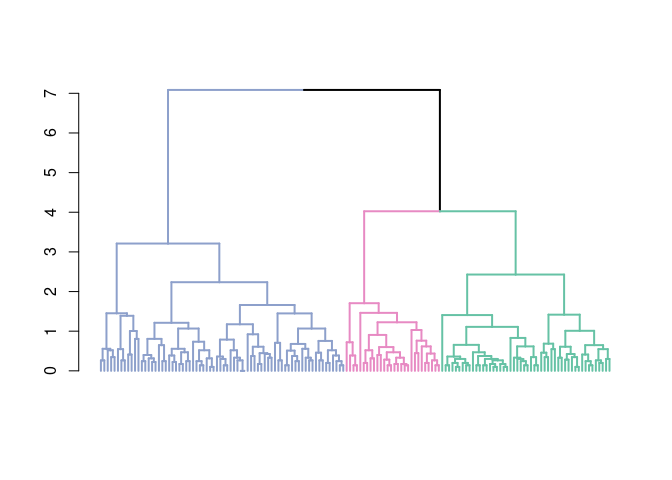

<!-- README.md is generated from README.Rmd. Please edit that file -->

# DRCdemand

<!-- badges: start -->

[](https://github.com/DylanDijk/DRCdemand/actions/workflows/R-CMD-check.yaml)
[](https://github.com/DylanDijk/DRCdemand/actions/workflows/test-coverage.yaml)
<!-- badges: end -->

The goal of DRCdemand is to aid in the analysis of the Irish electricity
demand data set. Namely, we provide functions to perform clustering,
forecasting and model aggregation.

## Installation

You can install the development version of DRCdemand from
[GitHub](https://github.com/) with:

``` r
# install.packages("devtools")
devtools::install_github("DylanDijk/DRCdemand")
```

## Example

This is a basic example which shows you how to compute Gower’s
dissimilarity matrix:

``` r
library(DRCdemand)
data <- data.frame(
  V1 = c(1, 2, 3),
  V2 = c(4, 5, 6),
  V3 = c(7, 8, 9),
  V4 = as.factor(c(1, 1, 2))
)
gowers_distance(data)
#>       1     2
#> 2 0.375      
#> 3 1.000 0.625
```

We can also use our package to plot results from hierarchical
clustering, demonstrated here using the R `iris` data:

``` r
hc <- hclust(dist(iris[, 1:4]))
dend <- as.dendrogram(hc)
pal <- c("#8DA0CB", "#E78AC3", "#66C2A5")
DRCdemand::plot_clusters(dend, 3, pal)
```


